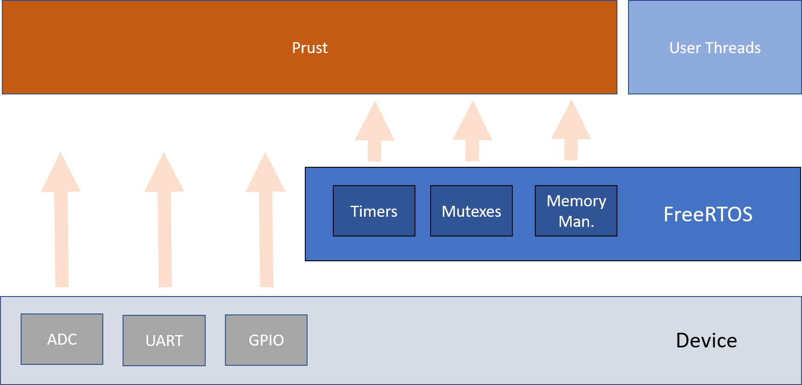

# Prust-RTOS-Gen
New main repo for the C code that contains Prust module written in Rust. Most of it is generated code except the prust part. Auto-generated mostly for VST104

# How To Build
Build Prust-RTOS project from ../Middlewares/ThirdParty/Prust-RTOS. See [Prust-RTOS](https://github.com/visionspacetec/Prust-RTOS)

# Design
Design specific for the VST104 example:  
 

# Short Tutorial Of This Demo 
- See the wiki page [here](https://github.com/visionspacetec/Prust/wiki/How-I-Built-This-On-VST104)
