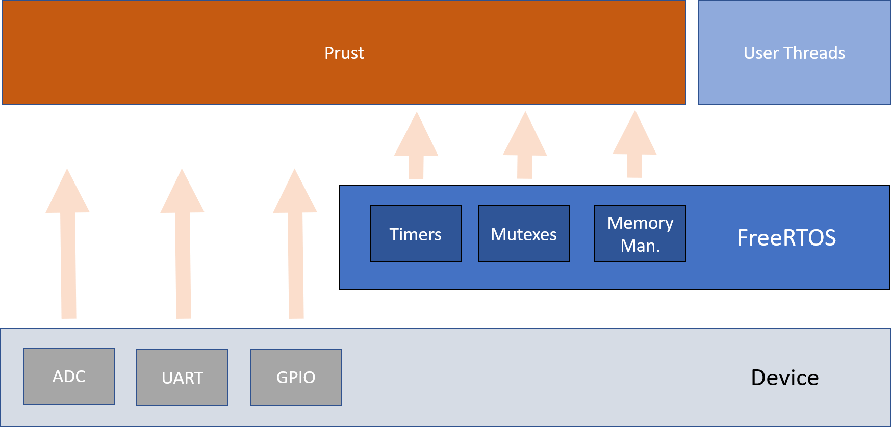

# Prust-FreeRTOS
New main repo for the C code that contains Prust module written in Rust. Most of it is generated code except the prust part. Auto-generated mostly for VST104

```
Prust-FreeRTOS  
+-- Middlewares/Third_Party/  
|     +-- Prust-App            <-submodule: https://github.com/visionspacetec/Prust-App    
|     +-- FreeRTOS              <-FreeRTOS source code imported automatically by STM32CubeIDE
+-- Core                   <-main.c, stm32hal4xx.h etc.  
+-- Drivers                <-Drivers mostly auto-generated  
+-- Prust.ioc              <-STM32CubeIDE configuration  
...
```

# How To Build  
```
git clone --recursive https://github.com/visionspacetec/Prust-FreeRTOS.git
```
Check the requirements in [Prust-App](https://github.com/visionspacetec/Prust-App) then build with the following commands,
```
cd Middlewares/ThirdParty/Prust-App
cargo build
```
You can now debug and run with Stm32CubeIDE's interface. 
For testing see [Prust-Test](https://github.com/visionspacetec/Prust-Test).

# Design
Design specific for the VST104 example:  
 



# Short Tutorial Of This Demo 
- See how this was done from scratch in wiki page [here](https://github.com/visionspacetec/Prust/wiki/How-To-Build-This-On-VST104)
